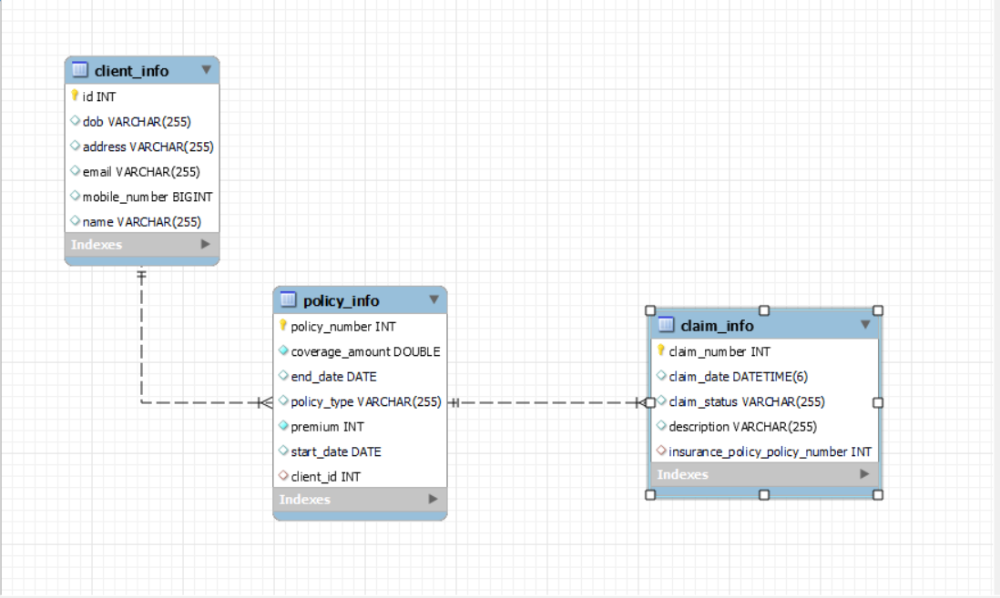

# Insurance_Management_System
The Insurance Management Platform is a web-based application built using Spring Boot and Java. This platform provides an end-to-end solution for managing                  insurance policies, claims. It allows insurance companies to easily manage their customers' policies, track their claims.

This project there are three different entitys in this Client, InsurancePolicy, Claim  with all of have a different attributes.

In this each of them are connect with the different mapping OnetoOne and OnetoMany respectively.

# Functionality

&#8226; Policy Management  
&#8226; Customer Management  
&#8226; Claims Management  
&#8226; Analytics and Reports  
&#8226; Automated Underwriting  
&#8226; Fraud Detection  

# Different Models / Entities / (Table in MySQL) In the Project

&#8226; Client Entity  
&#8226; InsurancePolicy Entity  
&#8226; Claim Entity  

# Teck-Stack Used :
&#8226; Spring-Boot  
&#8226; MySQL  
&#8226; Java  
&#8226; Hibernate  
&#8226; JPA  

# Schema Design

